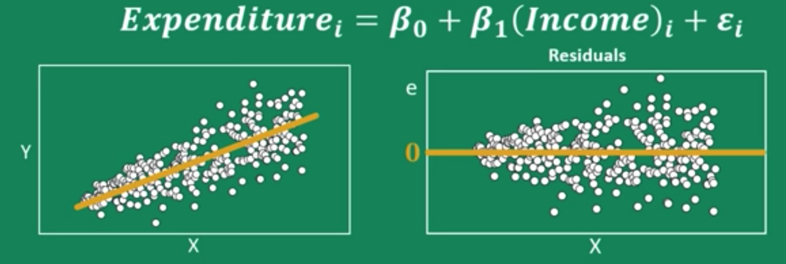
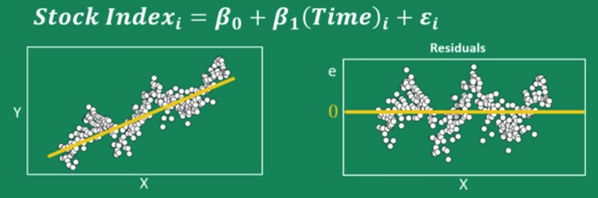
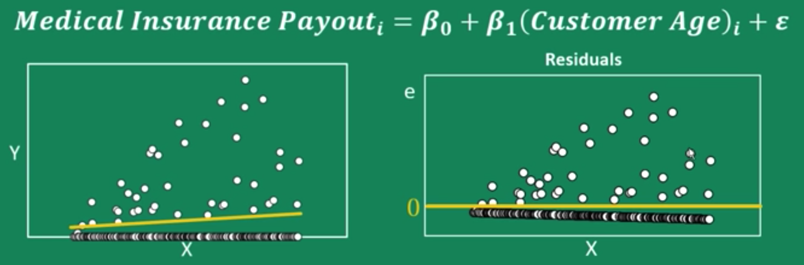

*This post is only for myself quickly reviewing regression assumptions and closely follows a Youtube video by [***zedstatistics***](https://www.youtube.com/watch?v=0MFpOQRY0rw).*

# Regression Assumptions

### 1. Linearity (Correct functional form written as a linear equation)
- A regression model is linear and additive in terms of coefficients.
- If functional form is incorrect, both the coefficients and standard errors in my output are unreliable.
- How to detect?
  - Draw a residual plots
  - Likelihood ratio (LR) test
- Remedies?
  - Trial and error
  - Add higher order of variables to the model. (Watch out p-hacking or overfitting!)
  - Compare the goodness-of-fit of each model.

### 2. Constant Error Variance (Homoskedasticity)
- In some models, as X increses, the variance of the error term also increases. (Heteroskedasticity)

*source: [***zedstatistics***](https://www.youtube.com/watch?v=0MFpOQRY0rw)*

- Under heteroskedasticity, standard errors in output cannot be relied upon. (Our coefficients are still unbiased.)
- How to detect?
  - Goldfeldt-Quant test
  - Breusch-Pagan test
- Remedies?
  - White's standard errors (Robust standard errors): Using this, our SE slightly increases.
  - Weighted least squares
  - Apply log to both x and y

### 3. Independent Error Terms
- An error term is not dependent on the error prior or next to itself.(No autocorrelation.)
  - If there's an autocorrelation issue and I know one residual, I can guess the next residual based on this observed residual.

*source: [***zedstatistics***](https://www.youtube.com/watch?v=0MFpOQRY0rw)*  

- Under autocorrelation, standard errors in output cannot be relied upon. (The estimated coefficients are still unbiased, but any inferences based on the SE such as confidence interval can be controversial.)
- Usully occured in time-series data.
- How to detect?
  - Durbin-Watson test (detecting autocorrelation for the first order)
  - Breusch-Godfrey test
- Remedies?
  - Investigate omitted variables
  - Generalised difference equation (Cochrane-Orchutt or AR methods)

### 4. Normal errors
- Points should be centered around the fitted line.

*source: [***zedstatistics***](https://www.youtube.com/watch?v=0MFpOQRY0rw)*
- If normality is violated and n is small, standard errors in output are affected.
  - In fact, this assumption is a somehow weak assumption, so with a large number of observations, the central limit theorem (CLT) can be applied and a true relationship can be drawn.
- How to detect?
  - Histogram of residuals or QQ plot
  - Shapiro-Wilk test
  - Komolgorov-Smirnov test
  - Anderson-Darling test
- Remedies?
  - Change functional form (e.g. log)

### 5. No Multi-collinearity
- Explanatory variables are dependent each other **to a large extent**.
- Coefficients and standard errors of affected variables are unreliable.
- How to detect?
  - Look at correlation between X variables
  - Investigate Variance inflation factors (VIF): Compare the variances of two models one of which include a particular variable and the other model don't. When the variable is included in the model, if the variance of the model rapidly incerases, there might be a multi-collinearity issue.
- Remedies?
  - Remove one of the variables.

### 6. Exogeneity (no omitted variable bias)
- If there is a hidden variable pulling the string of the relationship between my X and Y, it could cause omitted variable bias.
- The hidden variable would affect $\varepsilon_i$ in the model, thus my X is no longer wholly exogenous (or no longer wholly determined from outside the model) as it can be explained in part by the error term (endogeneity).
- With this issue, my model can only be used for predictive purposes (cannot infer causation ).
- How to detect?
  - Intuition
  - Checking correlations
- Remedy?
  - Use instrumental variables (IVs)
  - Randomized Controlled Trial (RCT) (if possible)

